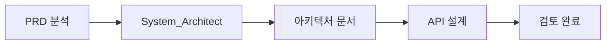
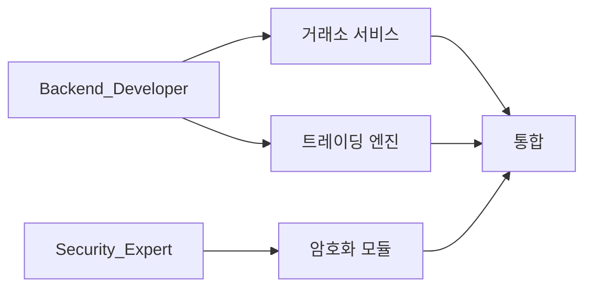
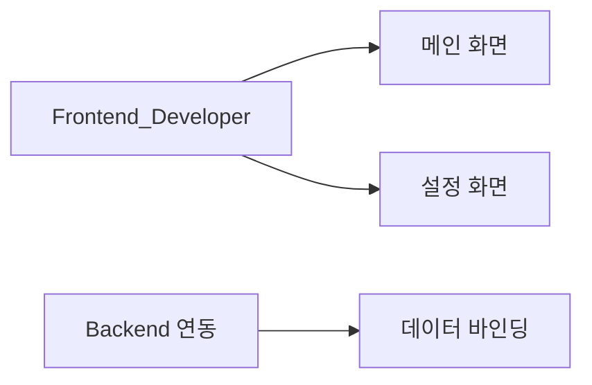
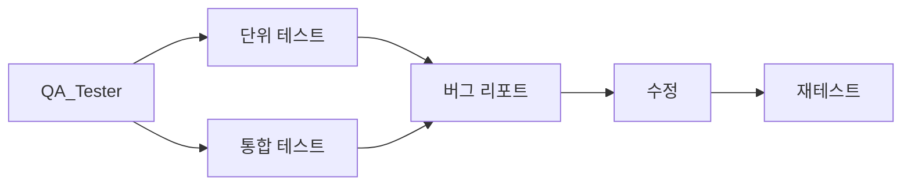

# 서브에이전트 및 스킬 할당 계획

> **문서 버전:** v1.0
> **작성일:** 2025-12-09
> **프로젝트:** 김치프리미엄 기반 1:1 헷지 자동매매 시스템

---

## 1. 서브에이전트 팀 구성

### 1.1 에이전트 목록

| 역할 | 에이전트명 | 담당 폴더 | 주요 책임 |
|------|-----------|-----------|-----------|
| 오케스트레이터 | `Orchestrator` | `/docs/dashboard.md` | 전체 진행 조율, 대시보드 관리 |
| 아키텍트 | `System_Architect` | `/docs/architecture` | 시스템 설계, 컴포넌트 구조 |
| 백엔드 개발 | `Backend_Developer` | `/src/Core`, `/src/Services` | 핵심 로직, 거래소 연동 |
| 프론트엔드 개발 | `Frontend_Developer` | `/src/UI`, `/src/ViewModels` | WPF/WinForms UI 개발 |
| 보안 전문가 | `Security_Expert` | `/src/Security` | 암호화, 인증, 보안 정책 |
| QA 테스터 | `QA_Tester` | `/docs/tests`, `/tests` | 테스트 케이스, 버그 리포트 |
| 스킬 생성자 | `Skill_Creator` | `/docs/skills` | 반복 패턴 스킬화 |

---

## 2. 에이전트별 상세 역할

### 2.1 System_Architect
**책임 범위:**
- 전체 시스템 아키텍처 설계
- 컴포넌트 간 의존성 정의
- 데이터 흐름 설계
- 기술 스택 최종 결정

**산출물:**
- `docs/architecture/system_architecture.md`
- `docs/architecture/component_diagram.md`
- `docs/architecture/data_flow.md`
- `docs/architecture/tech_stack.md`

### 2.2 Backend_Developer
**책임 범위:**
- 김프 수신 및 조건 비교 로직
- 거래소 API 연동 (업비트, BingX, Bybit)
- 주문 실행 엔진
- 포지션 동기화 로직
- 손익 계산 서비스

**담당 네임스페이스:**
```
/src
  /Core
    - TradingEngine.cs
    - PositionManager.cs
    - PnLCalculator.cs
  /Services
    - KimchiPremiumService.cs
    - UpbitService.cs
    - BingXService.cs
    - BybitService.cs
  /Models
    - Position.cs
    - Order.cs
    - KimchiData.cs
```

### 2.3 Frontend_Developer
**책임 범위:**
- 메인 대시보드 UI
- 설정 화면
- 실시간 데이터 바인딩
- 로그 뷰어
- 시스템 트레이 연동

**담당 네임스페이스:**
```
/src
  /UI
    /Views
      - MainWindow.xaml
      - SettingsView.xaml
      - LogView.xaml
    /Controls
      - KimchiGauge.xaml
      - PositionCard.xaml
  /ViewModels
    - MainViewModel.cs
    - SettingsViewModel.cs
```

### 2.4 Security_Expert
**책임 범위:**
- API Key AES-256 암호화/복호화
- 인증 토큰 관리
- 안전한 로컬 저장소
- HTTPS 통신 검증
- 보안 감사 체크리스트

**담당 네임스페이스:**
```
/src
  /Security
    - CryptoService.cs
    - SecureStorage.cs
    - AuthenticationManager.cs
    - TokenService.cs
```

### 2.5 QA_Tester
**책임 범위:**
- 단위 테스트 작성
- 통합 테스트 시나리오
- 엣지 케이스 테스트
- 버그 리포트 작성
- 회귀 테스트

**담당 폴더:**
```
/tests
  /Unit
    - TradingEngineTests.cs
    - PnLCalculatorTests.cs
  /Integration
    - ExchangeApiTests.cs
    - FullFlowTests.cs
/docs/tests
  - test_cases.md
  - bug_report_*.md
```

### 2.6 Skill_Creator
**책임 범위:**
- 반복 패턴 식별
- 재사용 가능한 스킬 생성
- 스킬 문서화
- 워크플로우 최적화 제안

**담당 폴더:**
```
/docs/skills
  - exchange_api_integration.md
  - async_order_handling.md
  - error_retry_pattern.md
```

---

## 3. Claude Skills 정의

### 3.1 거래소 API 연동 스킬
```yaml
name: exchange-api-integration
description: 거래소 REST/WebSocket API 연동 패턴
triggers:
  - "업비트 API 연동"
  - "BingX API 연동"
  - "거래소 연결"
template: |
  1. API 클라이언트 클래스 생성
  2. 인증 헤더 구성 (HMAC-SHA256)
  3. Rate Limit 처리
  4. 에러 핸들링 및 재시도 로직
  5. 응답 모델 매핑
```

### 3.2 안전한 주문 실행 스킬
```yaml
name: safe-order-execution
description: 원자적 주문 실행 및 롤백 패턴
triggers:
  - "주문 실행"
  - "헷지 진입"
  - "포지션 청산"
template: |
  1. 사전 조건 검증
  2. 트랜잭션 시작
  3. 1차 주문 실행 (업비트)
  4. 체결 확인
  5. 2차 주문 실행 (해외)
  6. 동기화 검증
  7. 실패 시 롤백
```

### 3.3 실시간 데이터 처리 스킬
```yaml
name: realtime-data-processing
description: WebSocket 실시간 데이터 수신 및 처리
triggers:
  - "김프 실시간"
  - "WebSocket 연결"
  - "실시간 업데이트"
template: |
  1. WebSocket 클라이언트 초기화
  2. 재연결 로직 구현
  3. 메시지 파싱
  4. Observable 스트림 변환
  5. UI 바인딩
```

### 3.4 암호화 저장 스킬
```yaml
name: secure-storage
description: 민감 데이터 암호화 저장 패턴
triggers:
  - "API Key 저장"
  - "암호화"
  - "보안 저장"
template: |
  1. DPAPI 또는 AES-256 선택
  2. 키 파생 (PBKDF2)
  3. 암호화 저장
  4. 복호화 로드
  5. 메모리 보안 처리
```

---

## 4. 작업 흐름 (Workflow)

### Phase 1: 설계 (Design)


### Phase 2: 핵심 개발 (Core Development)


### Phase 3: UI 개발 (UI Development)


### Phase 4: 테스트 (Testing)


---

## 5. 커밋 컨벤션

```
<type>(<scope>): <subject> - by <agent_name>

예시:
feat(Backend): Add Upbit market order API - by Backend_Developer
fix(Security): Resolve AES key derivation issue - by Security_Expert
test(QA): Add position sync edge case tests - by QA_Tester
docs(Arch): Update component diagram - by System_Architect
refactor(UI): Improve MVVM binding pattern - by Frontend_Developer
```

---

## 6. 대시보드 템플릿

```markdown
# 프로젝트 대시보드

## 프로젝트 목표
김치프리미엄 기반 1:1 헷지 자동매매 시스템 (C# Windows EXE)

## 전체 진행률
[████████░░░░░░░░░░░░] 40%

## 에이전트별 현재 상태
| 에이전트 | 상태 | 현재 작업 |
|----------|------|-----------|
| System_Architect | ✅ 완료 | 아키텍처 설계 완료 |
| Backend_Developer | 🔄 진행중 | 업비트 API 연동 |
| Frontend_Developer | ⏳ 대기 | 백엔드 완료 대기 |
| Security_Expert | 🔄 진행중 | 암호화 모듈 개발 |
| QA_Tester | ⏳ 대기 | 테스트 케이스 준비 |
| Skill_Creator | 📝 모니터링 | 패턴 분석 중 |

## 최근 활동 로그
- [2025-12-09 10:00] System_Architect: 아키텍처 문서 v1 완료
- [2025-12-09 10:30] Backend_Developer: 업비트 서비스 구현 시작

## 다음 단계
1. 거래소 API 서비스 구현 완료
2. 트레이딩 엔진 핵심 로직 구현
3. UI 프레임워크 선정 및 개발 시작
```

---

## 7. 예상 마일스톤

| 마일스톤 | 담당 에이전트 | 주요 산출물 |
|----------|---------------|-------------|
| M1: 설계 완료 | System_Architect | 아키텍처 문서 |
| M2: 거래소 연동 | Backend_Developer | API 서비스 |
| M3: 트레이딩 엔진 | Backend_Developer | 핵심 로직 |
| M4: 보안 모듈 | Security_Expert | 암호화/인증 |
| M5: UI v1 | Frontend_Developer | 기본 UI |
| M6: 알파 테스트 | QA_Tester | 테스트 리포트 |
| M7: 베타 릴리즈 | All | 실행 가능 EXE |

---

위 계획에 따라 프로젝트를 진행하겠습니다.
사용자 확인 후 서브에이전트 팀을 생성하고 작업을 시작할 수 있습니다.
